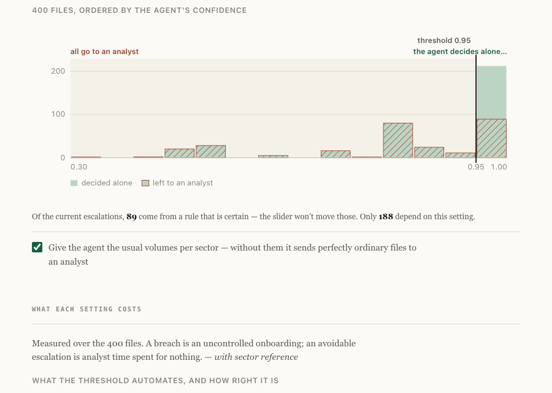
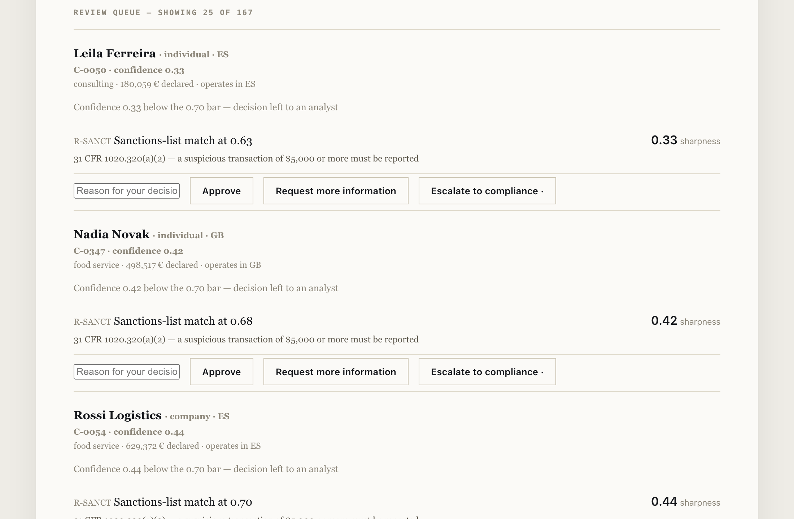

# An onboarding triage agent that knows where to stop

An agent applies a bank's onboarding procedure to each client file, cites the clause behind
every decision, and **hands the file to a human when it isn't confident**.

<!-- figures:finding -->
**The finding.** Moving the confidence bar was never the expensive lever. The escalations came from one badly informed rule — a flat volume ceiling applied to every sector — and giving the agent sector context took automation from **36.0 %** to **58.3 %**, wasted escalations from 159 to 69, and breaches from 1 to **0**. Dragging the bar had cost breaches for every point it bought.
<!-- /figures:finding -->

**[Try it in your browser →](https://arslanesempai-ui.github.io/kyc-triage-agent/)** — the whole agent runs client-side. Drag the confidence bar and watch the trade-off move. No install, nothing leaves your machine.



```bash
npm start          # the review queue, on localhost:4500
npm run mesurer    # the trade-off table below
npm run sensibilite # which of my own constants decide anything
npm test           # types, README figures, and <!--p:portfolio.parDepot.triage-->80<!--/p--> tests
```

Everything runs locally. No API key, no external service, no data leaving the machine.

> Every case is **synthetic and generated**, deliberately. A real onboarding file cannot
> leave a bank, and a demonstration nobody can run proves nothing. What that costs is
> spelled out under [Where every number comes from](#where-every-number-comes-from).

---

## The problem this is really about

Automating a compliance decision is easy. Automating it in a way that survives a
regulator's question eighteen months later is the actual job.

Three things have to hold at once:

1. Every decision **cites the clause** it rests on. A decision without a reason is
   indefensible, whoever made it.
2. The agent **decides only where it is confident**, and says so out loud when it isn't.
3. The cost of that boundary is **measured**, not asserted — because moving it trades
   analyst hours against regulatory exposure, and that trade belongs to the business.

I spent six years on the receiving end of this work: 30,000+ profiles reviewed, 6,000+
high-risk escalations. The false positive rate was never a number on a slide. It was the
size of the pile on my desk.

---

## What it looks like



The queue is sorted **least confident first** — that's where a human opinion is worth the
most. Each file shows what the agent saw, which rules fired, the clause behind each one,
and how sharp the observation was. The interface runs in French or English.

No action is visually promoted. An early version filled *Approve* in green, which made
approval the reflex click on a compliance queue — precisely backwards. Now only the
agent's own proposal is marked, and quietly: it informs, it doesn't invite.

When a human overrides, the disagreement is recorded. That's the only material that will
ever support the sentence "the agent is systematically wrong here" instead of "the
analysts are complaining". The agreement rate stays hidden until ten decisions exist —
a rate over two samples is noise wearing a percentage sign.

The threshold carries its own honesty check. Most escalations come from rules that are
*certain*, and no amount of dragging will move those; the screen says how many of the
current escalations the setting actually governs. A control that appears to do nothing
teaches people the tool is broken.

---

## What was measured

<!--p:triage.dossiers-->400<!--/p--> synthetic files, each carrying the decision an experienced analyst would have made.
Two errors share the word "mistake" and do not share a price:

- **an unnecessary escalation** — a file sent to a human for nothing: *operational cost*
- **a breach** — decided alone when it should have been escalated: *regulatory cost*

Counting them together hides the only one that matters.

<!-- figures:tradeoff -->
| Confidence bar | Handled without a human | Correct | Breaches | Wasted escalations |
|---|---|---|---|---|
| 0.50 | 58.3 % | 98.3 % | 0 | 69 |
| 0.70 | 58.3 % | 98.3 % | 0 | 69 |
| 0.80 | 54.3 % | 98.2 % | 0 | 85 |
| 0.90 | 31.0 % | 96.8 % | 0 | 178 |
<!-- /figures:tradeoff -->

### Then the interesting part

Notice that 0.50 and 0.70 produce **identical results**. A week spent tuning that bar
would have bought nothing.

The 146 unnecessary escalations weren't caused by a rule firing wrongly. They were caused
by **low confidence** — and tracing which rule capped it gave a single answer: 125 of 146
came from the volume rule. The agent was applying one flat ceiling of €1.5M to every
sector. An import-export business at €3M is ordinary; a consultancy at €3M is not. The
agent didn't know the difference, so it stopped.

Giving it the sector reference it was missing:

<!-- figures:context -->
|  | Handled without a human | Wasted escalations | Breaches |
|---|---|---|---|
| Without sector context | 36.0 % | 159 | 1 |
| **With sector context** | **58.3 %** | **69** | **0** |
<!-- /figures:context -->

**+39 % relative automation, −42 % wasted analyst time, identical regulatory safety** —
and none of it came from the threshold.

> You don't tune your way out of a missing-context problem.

The mechanism worked exactly as designed: the agent's ignorance surfaced as *low
confidence* rather than as a *wrong decision*. It flagged its own weakest rule. That is
the whole argument for making confidence a first-class output instead of a hidden number.

---

## What every decision cites

An earlier version of this agent cited clauses I had invented — `PR-101 §5` was a label
chosen so that decisions would reference *something*, and a reader could check none of
them. For a tool whose entire argument is that an automated decision must be defensible,
that was the one thing it could not do.

Each rule now names a section of 31 CFR that was actually retrieved, or says plainly that
it enforces a bank's own control rather than a rule of law. Both are honest. A made-up
citation is not.

<!-- figures:citations -->
| Citation | Requires | Figure | Retrieved |
|---|---|---|---|
| [31 CFR 1020.320(a)(2)](https://www.law.cornell.edu/cfr/text/31/1020.320) | A bank must report a suspicious transaction conducted or attempted by, at or through it once the amount involved or aggregated reaches the threshold. | $5,000 | 2026-08-17 |
| [31 CFR 1010.230(d)(1)](https://www.law.cornell.edu/cfr/text/31/1010.230) | Each individual holding a quarter or more of the equity of a legal entity customer must be identified. | 25 % | 2026-08-17 |
| [31 CFR 1010.230(d)(2)](https://www.law.cornell.edu/cfr/text/31/1010.230) | One individual with significant responsibility to control or direct the entity must be identified, in addition to any owners. | 1 individual | 2026-08-17 |
| [31 CFR 1010.230(a)](https://www.law.cornell.edu/cfr/text/31/1010.230) | Beneficial owners are identified when the account is opened, not afterwards. | — | 2026-08-17 |
| [31 CFR 1010.311](https://www.law.cornell.edu/cfr/text/31/1010.311) | A currency transaction above the threshold is reported by the financial institution. | $10,000 | 2026-08-17 |
<!-- /figures:citations -->

Nothing here is cited from memory. Every figure was fetched from the source on the date
shown, and a test fails if a rule claims a regulation whose citation its clause does not
carry.

The synthetic files remain synthetic — a real onboarding file cannot leave a bank. What is
no longer invented is the law they are judged against.

---

## Files written to break it

The four hundred synthetic cases are a *sample*: they cover what usually turns up, in
roughly the proportions it turns up in. That is the right shape for measuring a rate and
exactly the wrong shape for finding the failure that matters, because the failure that
matters is rare by construction.

So these are written by hand, one per way I could think of to get a file past an agent that
is trying to stop.

<!-- figures:adversarial -->
11 of 12 held.

|  | What it attacks | Expected | Got |
|---|---|---|---|
| **got through** | a sanctions match parked just below the look-at-it threshold | escalader | **approuver** |
| held | ownership split so no single holder reaches the 25 % identification threshold | escalader | escalader |
| held | a volume just under the sector multiple, in a monitored jurisdiction | escalader | escalader |
| held | a PEP match below the certainty threshold, with nothing else on the file | escalader | escalader |
| held | an identity document expiring in one month | complement | complement |
| held | a sector the reference table does not list | escalader | escalader |
| held | several weak signals, none of which trips a rule on its own | escalader | escalader |
| held | an empty name with a clean screening score | complement | complement |
| held | a company whose identified ownership sums to exactly 75 % | complement | complement |
| held | a high-risk jurisdiction reached through an intermediate one | escalader | escalader |
| held | a declared annual volume of zero | complement | complement |
| held | an unambiguous sanctions match — the one case that must never slip | escalader | escalader |

### What still gets through

**A-SEUIL** — expected `escalader`, got `approuver`.

> 0.54 against a 0.55 cut is not a cleaner match than 0.56 — it is the same evidence on the other side of a number I chose. Anyone who can see the threshold can sit under it.

These are not scored as a rate: 12 hand-written cases cannot support one, and the count that held is not the point. The point is that what fails is **named**, and a named failure is something a reviewer can argue about.
<!-- /figures:adversarial -->

**Seven of these did not hold when they were written.** An empty name screened clean. A
declared volume of zero sat below every ceiling and above no multiple. A PEP match at 0.80
was treated as noise while a sanctions match at the same score escalated. A passport with
thirty days left passed, and lapsed before the relationship was a quarter old. A sector the
reference table does not list fell back silently to a flat ceiling the sensitivity sweep had
already flagged as decisive.

Closing them **cost 4.7 points of automation and nineteen more files a week on an analyst's
desk**, which is the honest price and is why it is written here rather than absorbed into a
better-looking headline. The agent was more automated because it was looking at less.

---

## Against doing no work at all

"Handles <!--p:triage.partAutomatisee~pc0-->58 %<!--/p--> without a human" — against what? Escalate everything, or approve
everything: both take a line to implement, and they bracket the problem.

<!-- figures:baselines -->
|  | Automated | Breaches | Files to a human |
|---|---|---|---|
| always "escalader" | 0.0 % | 0 | 400 |
| always "approuver" | 100.0 % | 98 | 0 |
| **the agent** | 58.3 % | **0** | 167 |
<!-- /figures:baselines -->

Escalating everything is safe and unaffordable. Approving everything is free and
indefensible. Beating either one alone is worthless — the claim worth making is holding
most of the automation of the second while keeping the safety of the first, and it can
only be read beside both numbers.

Publishing an accuracy without its baseline invites the one question you cannot answer.

---

## Which of my own numbers decide the outcome

The constants swept below have no authority behind them. No regulation says where
a screening match becomes certain, what multiple of a sector norm is abnormal, or how much
margin to take against a reference table known to be approximate. I chose every one of them by
judgement, and a portfolio piece that publishes results without saying which judgements
they rest on is asking to be taken on trust.

So each one is swept across the range a competent person could disagree with me over, and
judged on **breaches** — files decided alone that had to go to a human. That is the error
with a fine attached; wasted escalations are analyst time.

<!-- figures:chosen -->
Measured over 5 independent draws of 800 files. What no source says about each of them:

- `seuilSanctionCertain` — no regulation says where a screening match becomes certain
- `seuilSanctionDoute` — nor where it becomes worth a second look
- `volumeEleve` — a flat ceiling, used only where no sector reference exists
- `multipleAnormal` — no source defines an abnormal multiple of a sector norm
- `prudence` — derived from the largest observed reference error, not from the outcome

| Constant | In use | Plausible range | Breaches per 800 files, low → high | Verdict |
|---|---|---|---|---|
| `seuilSanctionCertain` | 0.85 | 0.70 – 0.98 | 0.0 → 0.0 | No effect on either cost |
| `seuilSanctionDoute` | 0.55 | 0.30 – 0.80 | 0.0 → 22.6 | **Decides breaches**; the boundary is under the noise |
| `volumeEleve` | 1,500,000 | 400,000 – 5,000,000 | 0.0 → 19.6 † | **Dormant** — inert here, decisive without the sector table |
| `multipleAnormal` | 3.50 | 2.00 – 8.00 | 0.0 → 11.4 | **Decides breaches**; the boundary is under the noise |
| `prudence` | 0.85 | 0.70 – 1.00 | 0.0 → 4.2 | **Decides breaches**; the boundary is under the noise |

† measured with the sector table removed — see the note below.

0 of 5 can be defended with this measurement. 3 cost breaches at the far end of their range in every draw, and no draw agrees with the others on where that starts — they matter, and this measurement cannot tell you where to set them.
<!-- /figures:chosen -->

Two things about the method, both of which I got wrong first.

**One draw cannot tell a threshold from a coincidence.** The first version swept a single
sample and reported all but one of them as decisive — every one on a move from
no breach to a single one in 1,200 files. A different seed puts that edge somewhere else. Five
independent draws, and the question splits in two: *does it cost?* and *where does it start
costing?* The ones that cost breaches answer yes and don't know, which is awkward and true.

**Inert is not the same as irrelevant.** `volumeEleve` came back "no effect" because the
check meant to run it without a sector reference passed `undefined` to a parameter whose
default *was* the reference — so every dormancy check silently ran with the table. Removing
the table moves that constant from none to more than twenty breaches per 800 files, the
figure marked † above. The tool was telling a
reader to ignore the one number they would need the moment their reference data had a hole
in it. It is `sensibilite.ts` and a test that guard it now.

---

## How wrong may the reference be?

The failure gallery traced the single remaining breach to one row of the sector reference
table. That is worth generalising, because reference data is always approximate and nobody
asks how approximate it is allowed to be.

<!-- figures:sensitivity -->
| Reference error | Breaches | Wasted escalations | Automated |
|---|---|---|---|
| -30 % | 0 | 120 | 45.5 % |
| -20 % | 0 | 91 | 52.8 % |
| -10 % | 0 | 76 | 56.5 % |
| -5 % | 0 | 72 | 57.5 % |
| +0 % | 0 | 69 | 58.3 % |
| +5 % | 0 | 64 | 59.5 % |
| +10 % | 0 | 61 | 60.3 % |
| +20 % | 2 | 56 | 62.0 % |
| +30 % | 3 | 53 | 63.0 % |
<!-- /figures:sensitivity -->

The table is not symmetric, and neither is the price. Understating a norm makes the agent
escalate work it could have handled: analyst time, visible, nobody harmed. Overstating one
lets files through uncontrolled — and **improves every figure a dashboard shows** while
producing the only error that carries a fine.

<!-- figures:margin -->
The reference is used at **85 %** of its stated values. That margin is derived from the largest overstatement in the table (+14 %, on crypto-assets): 1 / 1.14 ≈ 0.88, rounded down. It is not chosen by looking at which value makes the results look best — that would be fitting the answer.

The sweep above then checked the derivation against outcomes, which is a different question. No draw loses a file anywhere below **0.88**, and the value in use is 0.85. The derivation landed inside the safe band with 0.03 to spare out of a range 0.30 wide — and that edge is one only 1 of 5 draws can see, so the headroom is smaller than the resolution of the thing measuring it. Derived honestly is not the same as derived safely; only the first of those two was ever checked, and the second is closer than the derivation suggested.
<!-- /figures:margin -->

---

## What it gets wrong

<!-- figures:failures -->
73 wrong decisions out of 400. Automated decisions are correct 100.0 % of the time, 95 % interval [98–100], n=233.

| Wrong decisions | Kind · rules that fired |
|---|---|
| 8 | escalade evitable · R-PEP |
| 7 | escalade evitable · R-JURID |
| 4 | complement rate · R-EXPIR |
| 4 | escalade evitable · R-JURID+R-PIECE+R-VOL |
| 4 | escalade evitable · R-PIECE+R-VOL |
| 3 | escalade evitable · R-LISIB+R-NOM+R-PEP |

**No breach remains.** Every file that had to go to a human went to a human.

The two worst remaining errors are wasted escalations — analyst time, not exposure:

```
C-0001 · Ferreira Logistics · societe · NL
  sector      import-export, 16,985,718 EUR declared
  screening   sanctions 0.17 · PEP 0.01
  agent said  escalader (confidence 0.88)
  should be   complement
  R-LISIB   Unreadable document: immatriculation  [sharpness 0.70]
  R-LISIB   Unreadable document: structure  [sharpness 0.70]
  R-VOL     €16,985,718 declared, 5.9× the norm for “import-export”  [sharpness 0.88]
```

```
C-0003 · Haddad Ventures · societe · GR
  sector      restauration, 2,183,844 EUR declared
  screening   sanctions 0.14 · PEP 0.07
  agent said  escalader (confidence 0.95)
  should be   complement
  R-LISIB   Unreadable document: domicile  [sharpness 0.70]
  R-BE25    1 beneficial owner(s) above 25 % not identified  [sharpness 1.00]
  R-VOL     €2,183,844 declared, 8.7× the norm for “restauration”  [sharpness 0.95]
```
<!-- /figures:failures -->

A count is a claim a reader takes on trust. A named file with the rules that fired beside
the decision an analyst would have made is something a compliance officer can argue with —
and arguing with it is the point.

---

## Where every number comes from

A table renders a figure retrieved from the Code of Federal Regulations and a figure I
picked in exactly the same typeface, which quietly claims they are equivalent. They are
not.

<!-- figures:provenance -->
**5 retrieved**, **5 measured**, **2 assumed**, **7 chosen**. What each kind means, and what you are entitled to ask of it:

- **retrieved** — a public source says this, on the date recorded, in words linked from the page. *follow the link.*
- **measured** — running the code in this repository produces it. *run it yourself — the draws are seeded.*
- **assumed** — an input nobody here can know; yours to supply. *put your own figure in, and read the band around it.*
- **chosen** — my judgement and nothing else. *check whether the sweep says it decides anything.*

| Kind | Name | What it is | Note |
|---|---|---|---|
| retrieved | `31 CFR 1020.320(a)(2)` | A bank must report a suspicious transaction conducted or attempted by, at or through it once the amount involved or aggregated reaches the threshold. | retrieved 2026-08-17 |
| retrieved | `31 CFR 1010.230(d)(1)` | Each individual holding a quarter or more of the equity of a legal entity customer must be identified. | retrieved 2026-08-17 |
| retrieved | `31 CFR 1010.230(d)(2)` | One individual with significant responsibility to control or direct the entity must be identified, in addition to any owners. | retrieved 2026-08-17 |
| retrieved | `31 CFR 1010.230(a)` | Beneficial owners are identified when the account is opened, not afterwards. | retrieved 2026-08-17 |
| retrieved | `31 CFR 1010.311` | A currency transaction above the threshold is reported by the financial institution. | retrieved 2026-08-17 |
| measured | `tauxAutomatisation` | share of files decided without a human | measured on the synthetic case set below — see `genererCas` |
| measured | `manquements` | files decided alone that had to go to a human — the costly error | the error with a fine attached, counted separately from wasted analyst time |
| measured | `escaladesInutiles` | files sent to an analyst for nothing | analyst time; visible, and nobody is harmed |
| measured | `precisionAutomatisee` | how often an automated decision is the right one | published with its 95 % interval, because 400 files is not many |
| measured | `bande` | the range over which each chosen constant changes nothing | five independent draws; one draw cannot tell a threshold from a coincidence |
| assumed | `seuil` | the confidence below which the agent refuses to decide | belongs to the business, not to whoever writes the code; the screen edits it |
| assumed | `REFERENTIEL_SECTORIEL` | typical annual volume by sector | a market average, approximate like every reference table; the sweep says how wrong it may be |
| chosen | `seuilSanctionCertain` | above this, a screening match is treated as unambiguous | no regulation says where a match becomes certain; the sweep says this one decides |
| chosen | `seuilSanctionDoute` | below this, a screening match is not looked at at all | it costs breaches at the far end of its range; where it starts is under the sampling noise |
| chosen | `volumeEleve` | the flat ceiling used only where no sector reference exists | dormant with a complete table, decisive without one — not the same as irrelevant |
| chosen | `multipleAnormal` | multiple of the sector norm above which a volume is examined | no source defines an abnormal multiple; it costs breaches at 8× |
| chosen | `prudence` | the margin taken against the reference table being wrong | derived from observed reference error, not from outcomes — and the headroom is thinner than the measurement's resolution |
| chosen | `nettete` | how sharp each rule's trigger is, from 0 to 1 | the ordering is defensible — an unreadable document is fuzzier than an expired one; the values are mine |
| chosen | `genererCas` | the shape of the synthetic case set, and its ground truth | an agent scored against cases whose answers I wrote is marked by its own author |
<!-- /figures:provenance -->

The line that costs the most to write is the last one. "No breach in four hundred files" is
measured — run it and you get it, the draw is seeded — and the four hundred files are
synthetic, built by me, against a ground truth I also wrote. **An agent scored on cases
whose answers I chose is being marked by its own author.**

The defences elsewhere in this repository are real: the agent deliberately does not
reimplement the rule that scores it, it is measured against trivial baselines, every
failure is published in full, and every rate carries its interval. None of that makes a
synthetic case set a real one.

What survives is narrower and worth stating exactly: **the discipline is the finding, the
score is illustration.** That an automated decision should carry a citation, stop where it
is unsure, and be scored on breaches rather than on accuracy — that holds anywhere. That it
reaches <!--p:triage.partAutomatisee~pc0-->58 %<!--/p--> automation with no breach holds on my four hundred files.

---

## How it's built

```
src/
  cas.ts         synthetic case generator + ground truth (seeded, reproducible)
  agent.ts       rules, decision trace, confidence, escalation boundary
  referentiel.ts the sector context the agent was missing
  mesurer.ts     scoring: automation rate, breaches, wasted escalations
  file.ts        the review queue and recorded human overrides
  serveur.ts     local server
  ui.html        one screen
```

Node 26 with native TypeScript, `node:test`, no build step, no dependencies.

**Confidence** combines two things: how sharp each observation was, and whether any rule
left doubt behind. A sanctions match at 0.97 and one at 0.58 fire the same rule and do
not deserve the same confidence — conflating them is what makes an automation dangerous.

**The most severe decision wins.** Asking someone flagged against a sanctions list to
send a missing utility bill would tip them off.

**The case generator is seeded.** Without a fixed seed, two measurements aren't
comparable and you end up crediting a code change for what was just a different sample.

**The agent is deliberately not a copy of the ground truth.** An agent that reimplements
its own marking scheme scores 100 % and demonstrates nothing.

---

## What it doesn't do

- **No LLM.** Every decision here is a rule with a citation. That's a deliberate choice
  for this domain, not a limitation I worked around — and it means the confidence number
  is something I can explain rather than something I hope for.
- **No document reading.** Cases arrive structured. Extracting them from PDFs is a
  separate problem, which I solved separately in
  [compliance-document-search](https://github.com/ArslaneSempai-ui/compliance-document-search).
- **No learning from overrides.** They're recorded, not yet used. Closing that loop needs
  far more human decisions than a demonstration produces.
- **No pagination.** The queue shows the 25 least-confident files of however many are
  waiting, and says so.
- **Synthetic data.** Every conclusion above holds for this generator. On a real book of
  business, all of it must be re-measured — which is the first finding of the previous
  project, and the reason the measurement harness ships with the tool.

---

## What this does not let you conclude

Everything above is measured, and a measurement invites conclusions it does not support.
The ones this page is most likely to be read as making, and does not:

**Not "<!--p:triage.partAutomatisee~pc0-->58 %<!--/p--> of onboarding can be automated."** <!--p:triage.partAutomatisee~pc0-->58 %<!--/p--> of *these* files, under a rule set I
wrote, against a ground truth I also wrote. The number is a property of the generator as
much as of the agent. What travels is the shape: a well-informed rule beats a well-tuned
threshold, and the two are not substitutes.

**Not "zero breaches means it is safe."** Zero out of four hundred files puts a 95 %
interval of roughly [0 %–0.9 %] on the breach rate. On a real book of ten thousand
onboardings a year, the upper end of that interval is ninety uncontrolled entries. The
right reading is "no breach was observed at this size", which is a much smaller claim.

**Not "the constants are validated."** One of the five survives its own sweep. Three cost
breaches at the far end of their plausible range in every draw, and no draw agrees with
the others on where that starts. They are published because they matter, not because they
are settled.

**Not "an agent that stops when unsure is safe by construction."** It stops when its
*confidence* is low, and confidence is computed from rules it has. A file that is wrong in
a way no rule looks at produces high confidence and a clean approval. Abstention protects
against known uncertainty, and nothing protects against the other kind.

---

## What I would do differently

**Measure the generator against something real before building on it.** Every figure here
inherits the shape of a case set I invented. A hundred real files, anonymised and never
published, would have grounded the whole thing — and I would have found out early whether
the sector-volume rule is the lever it appears to be, rather than at the end.

**Write the sweep before the tuning, not after.** I picked the constants by judgement,
built the tool, and swept them last. The sweep then told me not one of them can be
defended by this measurement. Had it come first, I would have designed the case set to
resolve them instead of discovering it could not.

**Separate the rule engine from the scoring earlier.** The two were entangled long enough
that I nearly reimplemented the scoring rule inside the agent — the failure that gives you
100 % and demonstrates nothing. It took a deliberate rewrite to keep them apart, and it
would have cost nothing to start there.

**Stop trusting a figure because I typed it.** Three separate times a number on this page
disagreed with the code that produced it. Generating them from measured output was the fix,
and it should have been the starting position rather than the third correction.

---

## What a reviewer can check without running anything

Everything asserted here is anchored somewhere a reader can reach:

| Claim | Where it is checked |
|---|---|
| Every figure on this page | Generated from measured output; `npm test` fails if the page drifts |
| Every regulation cited | Linked to the section, with the retrieval date, and quoted verbatim |
| Every constant I chose | Declared in the inventory with an admission, and swept |
| Every failure | Published in full rather than summarised into a rate |
| Every rate | Carries its 95 % interval, and is withdrawn below 20 observations |
| The case draw | Seeded — a stranger running `npm test` gets these exact numbers |

That list is the actual deliverable. A tool that produces a good number and cannot show
where the number came from is worth less than one that produces a worse number and can.

---

**Arslane Chaouche Ramdane** — six years in AML/KYC and financial crime operations,
moving into AI transformation work.
